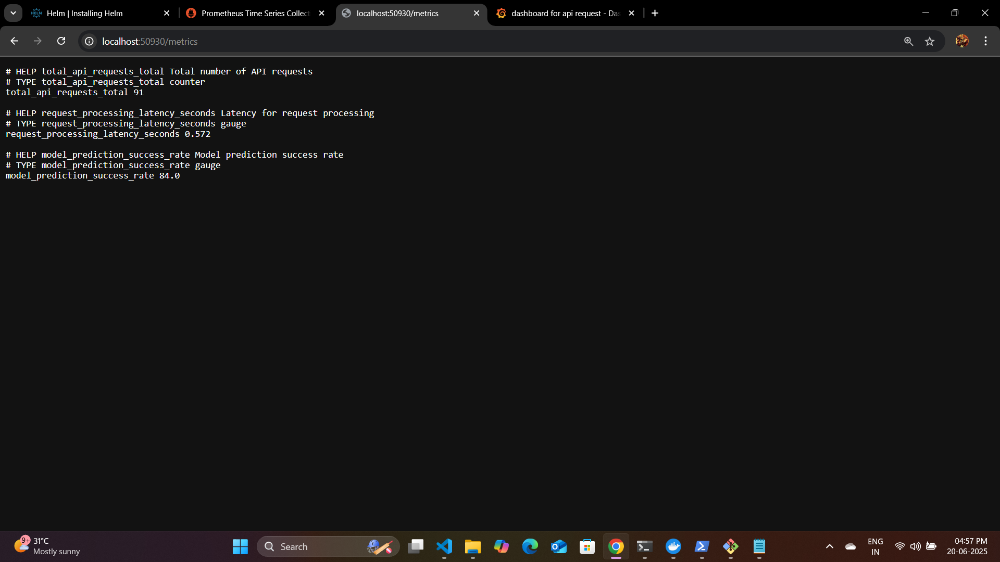
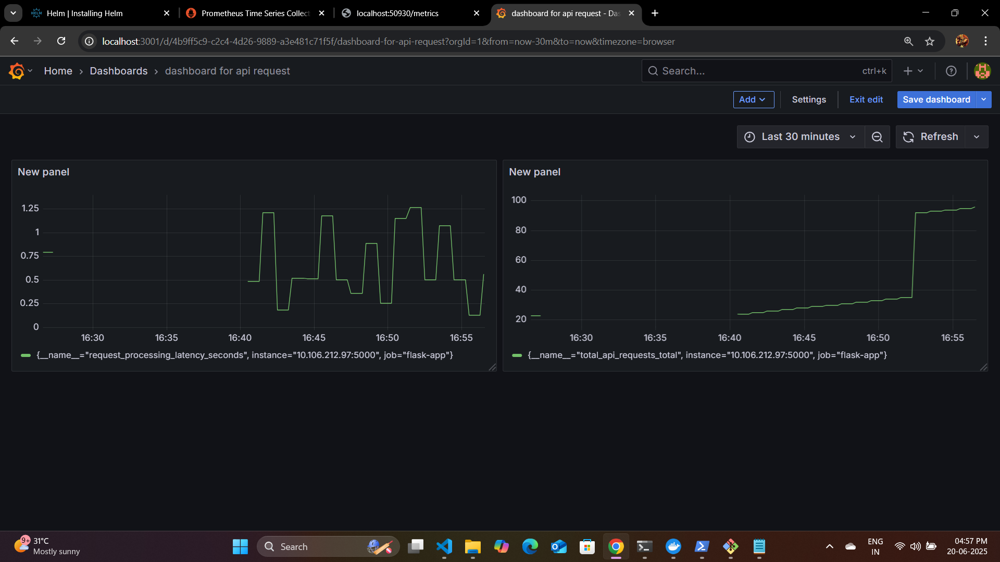

# 🚀 Flask Metrics App with Prometheus & Grafana on Minikube

<p align="center">
  
  
  
  
  
  
</p>

> ⚙️ Full observability pipeline using a custom Flask app, containerized with Docker, deployed via Kubernetes, monitored by Prometheus, and visualized in Grafana.

---

## 🛠️ Project Stack

| Tool           | Purpose                         |
| -------------- | ------------------------------- |
| **Flask**      | Web API with Prometheus metrics |
| **Docker**     | Containerization                |
| **Minikube**   | Local Kubernetes cluster        |
| **Helm**       | Package manager for Kubernetes  |
| **Prometheus** | Monitoring and metrics scraping |
| **Grafana**    | Visualization and dashboarding  |

---

## ⚙️ 1. Run Flask App Locally

```bash
pip install -r requirements.txt
python app.py
````

Verify on: [http://localhost:5000](http://localhost:5000)

---

## 🐳 2. Build Docker Image

```bash
docker build -t flask-metrics-app:latest .
```

---

## ☸️ 3. Deploy Flask App to Minikube

### ▶️ Start Minikube

```bash
minikube start
```

### 🐳 Load image into Minikube

```bash
minikube image load flask-metrics-app:latest
```

### 📄 Apply Kubernetes manifest

```bash
kubectl apply -f flask-app.yaml
```

### 🌐 Get service URL

```bash
minikube service flask-metrics-app --url
```

---

## 📈 4. Install Prometheus via Helm

### ⬇️ Add Helm repo

```bash
helm repo add prometheus-community https://prometheus-community.github.io/helm-charts
helm repo update
```

### 🚀 Install Prometheus

```bash
helm install prometheus prometheus-community/prometheus --namespace monitoring --create-namespace
```

### 🔍 Access Prometheus Dashboard

```bash
kubectl get svc -n monitoring
kubectl port-forward -n monitoring svc/prometheus-server 9090:80
```

Visit: [http://localhost:9090](http://localhost:9090)

---

## 📡 5. Configure Prometheus to Scrape Flask App

### 🔍 Get Flask service IP & port

```bash
kubectl get svc
```

Example:

```
10.107.61.186:5000
```

### 📝 Edit Prometheus config

```bash
kubectl edit configmap prometheus-server -n monitoring
```

Add under `scrape_configs`:

```yaml
  - job_name: 'flask-app'
    static_configs:
      - targets: ['10.107.61.186:5000']
```

### 🔁 Restart Prometheus

**Option A: Using Deployment**

```bash
kubectl rollout restart deployment prometheus-server -n monitoring
```

**Option B: Using Labels**

```bash
kubectl delete pod -l app.kubernetes.io/name=prometheus -n monitoring
```

---

## 📊 6. Install Grafana via Helm

### ⬇️ Add Grafana repo

```bash
helm repo add grafana https://grafana.github.io/helm-charts
helm repo update
```

### 🚀 Install Grafana

```bash
helm install grafana grafana/grafana -n monitoring --create-namespace
```

---

## 🔐 7. Access Grafana

### ⛳ Port forward

```bash
kubectl port-forward svc/grafana -n monitoring 3001:80
```

Visit: [http://localhost:3001](http://localhost:3001)

### 🔑 Get login credentials

#### For **Linux/Mac**:

```bash
kubectl get secret --namespace monitoring grafana -o jsonpath="{.data.admin-password}" | base64 --decode ; echo
```

#### For **Windows PowerShell**:

```powershell
kubectl get secret --namespace monitoring grafana -o jsonpath="{.data.admin-password}"
```

Then decode it:

```powershell
[System.Text.Encoding]::UTF8.GetString([System.Convert]::FromBase64String("<your_code_here>"))
```

Default username: `admin`

---

## ⚙️ 8. Add Prometheus as Data Source in Grafana

* Go to **Grafana → Connections → Data Sources → Add Data Source**
* Select **Prometheus**
* URL:

  ```
  http://prometheus-server.monitoring.svc.cluster.local:80
  ```
* Click **Save & Test**

---

## 📊 9. Create Dashboards in Grafana

* Navigate to: **Create → Dashboard → Add Panel**
* Use query like:

  ```
  total_api_requests_total
  ```
* Visualize and customize panel as needed.

---

## 📸 Screenshots

### 🧪 Flask App Exposing Metrics


*Figure: Custom `/metrics` endpoint in Flask showing Prometheus metrics*

### 📊 Grafana Dashboard


*Figure: Real-time dashboard showing API metrics from the Flask app*

---

## ✅ Sample Metrics Exposed

| Metric Name                  | Description                        |
| ---------------------------- | ---------------------------------- |
| `total_api_requests_total`   | Total number of API calls          |
| `request_processing_seconds` | Time taken to process requests     |
| `flask_http_requests_total`  | Flask default HTTP request metrics |

---

## 📂 Project Structure

```
.
├── app.py
├── requirements.txt
├── Dockerfile
├── flask-app.yaml
├── screenshots/
│   ├── metrics.png
│   └── garfana_dashboard.png
└── README.md
```

---

## 💡 What This Project Demonstrates

* ✅ Solid understanding of Kubernetes resource configuration
* ✅ Use of Prometheus for custom metric scraping
* ✅ Practical Grafana dashboard creation
* ✅ End-to-end DevOps workflow on Minikube

---

## 🙌 Credits

This project is developed as part of a personal deep-dive into Kubernetes observability and DevOps tooling.
Feel free to fork, contribute, or connect!
